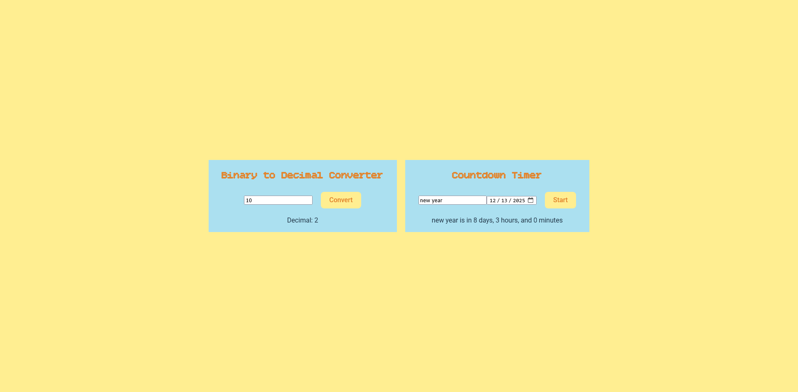

# Beginner Project Fiesta 🪇
This is a demonstration of several beginner projects from [this repo](https://github.com/florinpop17/app-ideas). I felt that they were all too small to justify their own repo, so I have collected them all here. 
## Technologies 🌮
- React
- Vite
- HTML
- CSS
## Features 🌵
1. Binary to Decimal converter [brief](https://github.com/florinpop17/app-ideas/blob/master/Projects/1-Beginner/Bin2Dec-App.md)
2. Countdown timer [brief](https://github.com/florinpop17/app-ideas/blob/master/Projects/1-Beginner/Countdown-Timer-App.md)
3. Basic DB App [brief](https://github.com/florinpop17/app-ideas/blob/master/Projects/1-Beginner/First-DB-App.md)
## The Process 🌶️
I created each project one at a time, adjusting the layout as I went. 
## What I Learned 🪅
For the first project I had to review how to convert between decimal and binary and how to do regex.  
For the second project I learned how to use local storage.  
For the third project I learned that there is a basic data base in the browser! This gives me a lot of ideas for small DB projects. I learned a lot about working with DBs in this project.
## What Could Be Improved 💃
I think the first project it good but the next logical step would be to convert from decimal to binary.  
For the second project I could have added a button to clear the values entered.  
For the third project I could add the ability for the user to add new customers.
## Demonstration 🌯
Screenshots 𐂃

